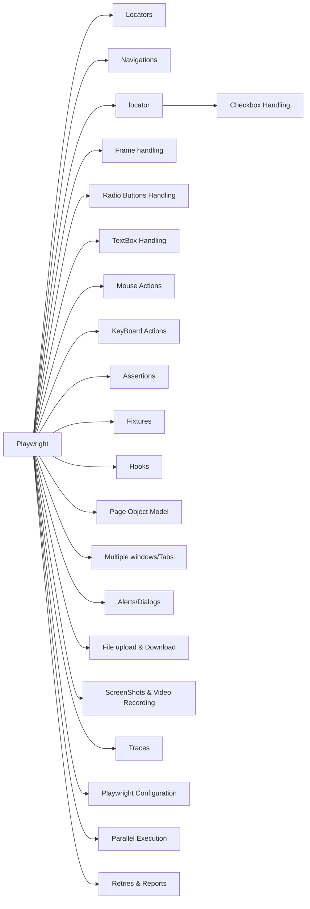

# 📘 Playwright Learning Roadmap

 

---

# 🎯 About This Repository

This repository contains my **Playwright learning journey**, covering concepts from the fundamentals to advanced Playwright and practical test automation.

The goal is not just to learn Playwright syntax, but to understand how Playwright can be used to build:

- 🧪 Test automation frameworks
- 🌐 Web automation
- 🔌 API automation
- 🛠️ Reusable utilities
- 📦 Scalable automation architecture
- 🚀 CI/CD-ready test frameworks
---

  

    
# 🗺️ Playwright Learning Roadmap

---

  
 <b> Playwright Concepts </b> 

<ol type=1>
<li> Playwright Architecture</li>

<li> Locators
  <ol type=I>
<li> Inbuilt Locators</li>
<li> CSS selector</li>
<li> Xpath</li>
    </ol>
</li>
<li> Mouse actions &emsp;
  <ol type=I>
<li> Hover &emsp; </li>
<li> Right Click &emsp;</li>
<li> Double click &emsp;</li>
<li> Drag and drop </li>
<li> horizontal slider</li>
<li> vertical slider</li>
    </ol>
</li>
<li> Keyboard actions
  <ol type=I>
<li> single press</li>
<li>holdiing key</li>
    </ol>
</li>
<li> Radio Button</li>
<li> Checkboxes </li>
<li> buttons </li>
<li> File upload/Download</li>
<ol type=I>
<li> single file upload</li>
<li> multi file upload </li>
    </ol>
<li> Alerts/Dialog</li>
<li> Snapshots / Videos</li>
<li> Assertions </li>
</ol>

---

  
 <b> Playwright Practise Questions </b> 

&emsp;
&emsp;

